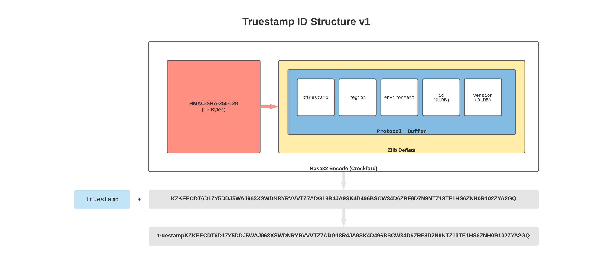

# Truestamp ID

## Description

An ID serialize/deserialize utility written in Typescript that supports Node.js.

## ID Structure

[LucidChart Doc](https://lucid.app/lucidchart/21ef4544-fa8e-4135-9657-40723a4bb293/edit?beaconFlowId=C1212F7C3FA80B71&page=0_0#)



## Example Code

There is a working code example for Node.js in the [/examples](/examples) directory.

## CLI

There is a **very** simple CLI that will **UNSAFELY** decode a Truestamp ID and
display the data stored within. It is considered unsafe because it does not verify
the HMAC signature on the data since that key is only known to the service.

```sh
$ truestamp-id truestampKZKEECDT6D17Y5DDJ5WAJ963XSWDNRYRVVVTZ7ADG18R4JA9SK4D496BSCW34D6ZRF8D7N9NTZ13TE1HS6ZNH0R102ZYA2GQ
{
  timestamp: 1627359031,
  region: 'us-east-1',
  environment: 'staging',
  id: '294jJ3YUoH1IEEm8GSabOs',
  version: 0
}
```

## Contributing

* Commit changes, merge PR's to `main` branch
* Bump `version` field in `package.json`
* Cut a new [release](https://github.com/truestamp/truestamp-id/releases)
* New release will trigger workflow to build, test, and publish private package to [Github Package Registry](https://github.com/truestamp/truestamp-id/packages).

## Legal

Copyright © 2021 Truestamp Inc. All Rights Reserved.
